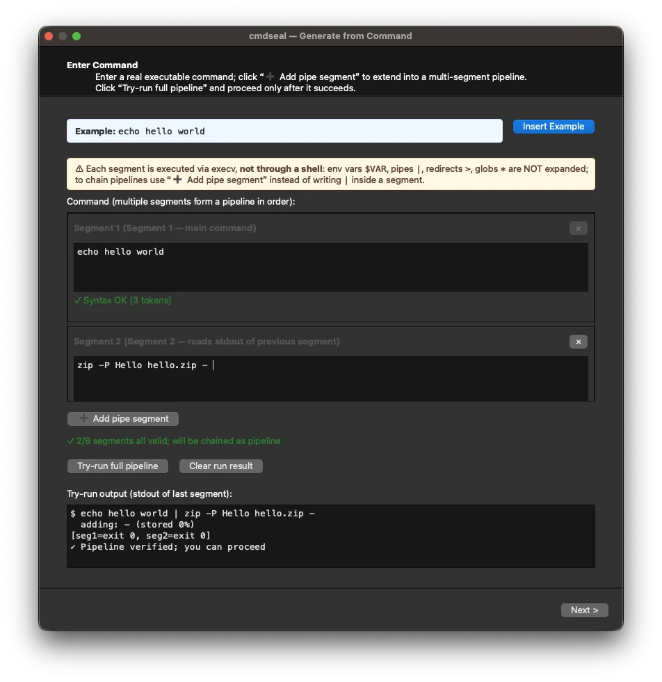

# cmdseal

> *Capability gateways for the AI agent era.*
> *Give your AI agent the ability to call sensitive commands without giving it the secrets.*

[中文版](./README.zh.md) · [DESIGN.md](./DESIGN.md) · [USER GUIDE](./USER_GUIDE.md)

`cmdseal` turns a command template plus secret values into a standalone
macOS binary. The binary can execute the exact command it was sealed
with — and *only* that command — without revealing the secret, even to
the user who runs it.

```
command template  ─┐
secret values  ────┼─►  AEAD-sealed runner (C)  ──►  ad-hoc signed binary
                   │                                     │
                   └──  AES-256 key K  ──►  login.keychain ACL bound to THIS binary's cdhash
```

Use case: you want an on-device AI agent (or a scripted pipeline) to be
able to call `zhmm_cmd --pwd ... --search <term>` without the agent
ever seeing the master password.

## Status

- ✅ CLI end-to-end working (macOS 13+, tested on 14 / 15 / 26)
- ✅ GUI (PySide6) seal wizard — optional, launches from the same repo
- ✅ `.app` bundle via `make app` (PyInstaller)
- ⚠️ macOS only for now (Linux / Windows are future work)
- ⚠️ Distributed as **source**; no Developer ID signed release yet

## Requirements

- macOS (Apple Silicon or Intel; tested on darwin 24+)
- Xcode Command Line Tools (`cc`, `codesign`)
- `/usr/bin/security` (ships with macOS)
- Python 3.11+ (CLI only uses stdlib)
- [`uv`](https://github.com/astral-sh/uv) — for the GUI / `.app` build
  (skip if you only use the CLI)

## Quick start (GUI)

<p align="center">
  
  <br>
  <em>Generate from Command wizard — turn a working command into a sealable template.</em>
</p>

If you prefer clicking:

```bash
git clone https://github.com/szgenle/cmdseal.git
cd cmdseal

make sync            # install PySide6 into a local uv venv
make app             # produces dist/cmdseal.app
open dist/cmdseal.app
```

This launches the seal wizard — a four-step GUI:
1. **Command** — type your command (e.g. `zip -j -P mypassword {{arg:1}}`)
2. **Secrets** — if you used `{{secret:NAME}}`, fill them in here (skipped otherwise)
3. **Options** — output path, label, signing identity
4. **Execute** — preview and run `cmdseal.py` in the background

The GUI is a thin wrapper over `cmdseal.py`; no crypto code is
duplicated. After sealing, you get a standalone binary that can be
handed to an AI agent or scripted pipeline.

The main window also offers two other entry points:

- **Generate from Command...** — if you already have a working command,
  the wizard auto-detects argument positions and generates a sealable
template with `{{arg:N}}` placeholders, saving you from manual rewriting.
- **Manage Runners...** — zero-popup listing of all sealed runners on
  this machine (metadata read from the keychain). Supports right-click
  to edit the template (when it contains no secret placeholders) or
cascading delete (cleans up both the keychain entry and the disk file).

### First-run dialog

The first time you run a freshly-sealed binary, macOS shows **one**
system dialog (login password + "Always Allow"). This is the
partition-list handshake binding the keychain item to this binary's
cdhash. It happens once per sealed binary per user; `cmdseal` itself
never asks for a password again. All subsequent runs are silent and
millisecond-fast.

## Advanced: CLI & scripting

For CI pipelines, AI-agent build scripts, or when you prefer the
terminal, `cmdseal.py` provides full CLI access:

```bash
# Seal a zip-with-password command. `zippw` is collected interactively
# and baked into the AEAD ciphertext; it is never stored in plaintext.
python3 cmdseal.py seal \
    --command 'zip -j -P {{secret:zippw}} {{arg:1}} {{arg:2}}' \
    --output  ./seal_zip
# → two password prompts (value + confirm), then ./seal_zip is built

# Use it — just two positional args now, no password on the command line.
./seal_zip  out.zip  /path/to/secret.txt
```

> **GUI users:** run `make app` instead; this CLI is for scripting,
> CI pipelines, and audits.

## Placeholder reference

| Placeholder       | Resolved at  | Source                                 |
| ----------------- | ------------ | -------------------------------------- |
| `{{secret:NAME}}` | seal time    | prompted, baked into AEAD ciphertext   |
| `{{arg:N}}`       | runtime      | `argv[N]` of the generated binary      |
| any other token   | —            | passed through verbatim                |

Placeholders must occupy a **whole argv position**. Mixed tokens like
`"--pwd={{secret:x}}"` are rejected; split them:
`--pwd {{secret:x}}`.

If you write a bare program name (e.g. `zip`), `cmdseal seal` resolves
it to an absolute path via `shutil.which` at seal time and bakes that
path in. The runner refuses `$PATH` lookup (see §Security model).

## A reproducible end-to-end example

The repo ships [`demo/demo_zip_input.txt`](./demo/demo_zip_input.txt)
as sample input; the flow below is copy-paste runnable on your
machine:

```bash
# 1) Seal an encrypted-zip command as demo/seal_zip. You will be
#    prompted twice for the value of `zippw` (say 'hunter2'):
python3 cmdseal.py seal \
    --command 'zip -j -P {{secret:zippw}} {{arg:1}} {{arg:2}}' \
    --output  ./demo/seal_zip

# 2) Use it to compress demo/demo_zip_input.txt into a
#    password-protected /tmp/out.zip:
./demo/seal_zip /tmp/out.zip ./demo/demo_zip_input.txt
# First run: ONE macOS partition-list dialog
# (login password + "Always Allow"). A one-time cost to bind the
# keychain item to this binary's cdhash. Subsequent runs: silent,
# sub-second.

# 3) Verify the archive really is password-protected:
unzip /tmp/out.zip -d /tmp/out
# → [/tmp/out.zip] demo_zip_input.txt password: ← requires hunter2

# 4) Verify the password was NOT baked into the binary in plaintext:
strings ./demo/seal_zip | grep -F 'hunter2' && echo FAIL || echo 'PASS: secret not in strings'
```

The payoff: step 2's `./demo/seal_zip` can be handed to an on-device
AI agent or a scripted pipeline. Neither can read `zippw`, and
neither can bypass the keychain ACL to fetch it directly:

```bash
# An agent trying to exfiltrate via the CLI:
/usr/bin/security find-generic-password -s cmdseal.<hash>.K -w
# → GUI approval prompt the agent cannot click through. Denied.
```

> If you forgot the `cmdseal.<hash>.K` service name printed at seal
> time, recover it with `strings ./demo/seal_zip | grep cmdseal`.

## Rotate the key without rebuilding the template

```bash
python3 cmdseal.py rotate ./seal_zip
# Generates a fresh AES-256 key, rewrites the AEAD ciphertext,
# re-signs the binary, swaps the keychain item atomically.
# No user interaction — runs silently in ~1s.
```

## GUI quick reference

```bash
make sync            # install PySide6 into a local uv venv
make run             # launches the main window (development mode)
make app             # produces dist/cmdseal.app (standalone)
open dist/cmdseal.app
```

The GUI is a thin wrapper over `cmdseal.py`; no crypto code is
duplicated. See [`gui/`](./gui/) for the sources.

| Entry point | When to use |
|-------------|-------------|
| **Generate from Command...** | You have a working command and want a template with placeholders auto-generated. |
| **Advanced Seal...** | You already have a template with `{{secret:NAME}}` / `{{arg:N}}` and want to seal it. |
| **Manage Runners...** | Review, edit, or delete existing sealed binaries and their keychain entries. |

Press `⌘,` (comma) to open **Preferences** and optionally set a default
output directory so the wizard always defaults to a fixed folder. The
window size is also persisted across restarts.

## Security model

### What cmdseal protects against

- **Secret exfiltration via the sealed binary's argv or `ps`** — the
  secret is in AEAD ciphertext embedded in the binary; it only exists
  in decrypted form inside the runner's address space for the brief
  window between keychain fetch and `execv`.
- **A different process (even the same user) reading the keychain
  item** — macOS partition-list / ACL bind the item to this exact
  binary's cdhash. Verified against `/usr/bin/security`, unrelated
  ad-hoc signed probes, and bitwise-identical copies — all blocked.
- **PATH-based program substitution** — the runner uses `execv` with
  an absolute path baked in at seal time (v1.1 #2); there is no
  runtime `$PATH` lookup.
- **Dylib injection via environment** — the runner strips `DYLD_*`
  and `LD_*` from its environment before `execv` (v1.1 #3), and is
  signed with `codesign --options runtime` (v1.1 #4) so dyld itself
  ignores those variables for this binary.

### What cmdseal does **not** protect against

- A **root** attacker, or any code running as root (can read any
  process memory, any keychain).
- A process running as the **same user** that gains arbitrary code
  execution and debugs / dumps the running sealed binary.
- Tampering with the generating machine before the binary was built.
- Snapshot / side-channel attacks on the target command (e.g. `zip`
  itself writing the password to some log; that's `zip`'s
  responsibility, not ours).
- Anything on Linux or Windows.

Be honest with yourself about the threat model before relying on
`cmdseal`. It is a **capability gateway**, not a vault.

See [DESIGN.md](./DESIGN.md) for the full threat model, the
partition-list empirical findings, and the rationale behind Plan D
(the current scheme).

## Housekeeping

```bash
# Inspect the keychain entry for a sealed binary (metadata only):
security find-generic-password -s cmdseal.<hash>.K

# Remove the entry (e.g. when retiring a binary):
security delete-generic-password -s cmdseal.<hash>.K

# Inspect the sealed binary's metadata (no secrets visible):
strings ./seal_zip | grep cmdseal

# List all known runners (JSON output for scripting):
python3 cmdseal.py list --json
```

You can also use the GUI's **Manage Runners...** entry point for a
visual overview with one-click delete.

## Distribution policy

We **do not** ship pre-built binaries. The sealing model is
per-machine (cdhash + your login keychain), so a binary built on
someone else's machine would be useless to you anyway. To use
`cmdseal`:

1. `git clone` the repo,
2. audit what you want to audit,
3. `make app` if you want a GUI, or use `cmdseal.py` directly for
   scripting.

If you want Developer-ID-signed notarized `.app` releases on GitHub,
[open an issue](https://github.com/szgenle/cmdseal/issues) —
it is gated on the maintainer joining the Apple Developer Program.

## Known limitations

- **First-run prompt on each sealed binary.** See §Quick start.
- **No registry** of which `cmdseal.<hash>.K` service belongs to
  which binary beyond `strings <binary> | grep cmdseal`.
- **No automatic cleanup** of keychain items when a sealed binary is
  deleted. Run `python3 cmdseal.py gc --dry-run` to audit orphans,
  then re-run without `--dry-run` to reap them. (GUI integration
  into **Manage Runners...** is planned.)
- **No argument whitelisting** — `{{arg:N}}` is passed to the target
  command verbatim. If the target command is picky about what values
  it accepts, that is on the target.
- **macOS only.** Linux (`libsecret`) / Windows (DPAPI) are future
  work; no ETA.

## License

[MIT](./LICENSE) — do what you want, attribution appreciated, no
warranty.

## Third-party

`cmdseal` uses [**PySide6**](https://pypi.org/project/PySide6/) and
[**Qt 6**](https://www.qt.io/), both under the
[LGPL-3.0](https://www.gnu.org/licenses/lgpl-3.0.txt) license.
Qt is a trademark of The Qt Company Ltd.; `cmdseal` is not affiliated
with or endorsed by The Qt Company.

See [`THIRD_PARTY_LICENSES.md`](./THIRD_PARTY_LICENSES.md) for the
full list of third-party components and our LGPL compliance notes.

## Related

- [DESIGN.md](./DESIGN.md) — architecture and design decisions
- [DESIGN.zh.md](./DESIGN.zh.md) — 中文设计说明
- Author: [lioesquieu](https://lioesquieu.github.io/)
